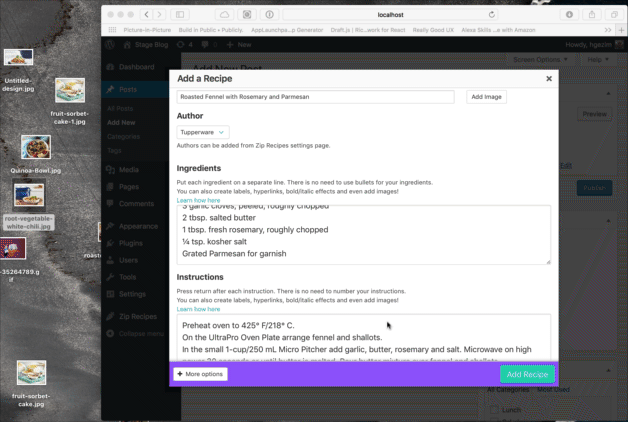
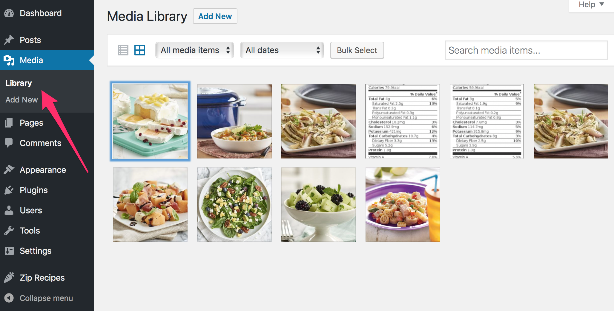
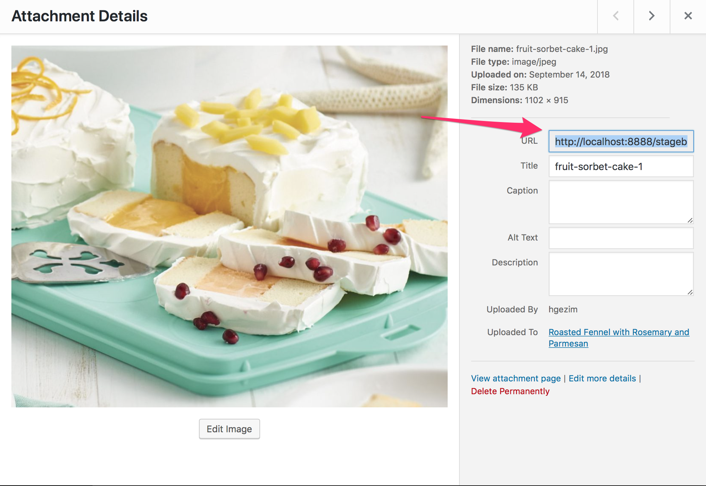
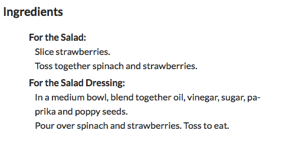

## Adding Links

Adding a link is easy. Whether you want to link out to Amazon to let your readers purchase ingredients or kitchen equipment, or you want to provide links to related recipes. You can do this from within the Ingredients, Instructions and Summary fields. Here’s what you do:

- To add linked text, include both the word or phrase to be linked and the URL within brackets with a divider in between. For example:
`[margarine|http://www.parkay.com]`
	

	Here's how Ingredients will appear in your actual blog post:
	
	

## Adding Pictures
### Main Picture
To add a picture to your recipe, you click the Add Image button which brings up the Media Library which has all the images you have uploaded from your computer to WordPress. If you don't have the image for the recipe you're creating, you can drag and drop it from your computer like so:



Once you have the image, you click on it to select it (you'll see a checkbox), you then click the `Select` button.

You now have added the main image to you recipe.

### Picture in Instructions or Ingredients section
We know that many food bloggers like to incorporate pictures into their step-by-step recipe instructions (some of you also like to include pictures within their ingredients list).

To add a picture, you first get the image URL. You can get the image URL from your _Media Library_ by selecting an image and clicking the image to bring up _Attachment Details_ screen and selecting the URL:




(To select the whole URL click rapidly three times with your mouse and whole URL should highlight then you can right click on it and copy.)

To add images between each recipe instruction, simply press enter after each instruction (__very important__). Then, add the image URL you copied preceded by a percentage sign. For example:

```
Slice mushrooms, carrots, red peppers and zucchini.
%https://upload.wikimedia.org/wikipedia/commons/thumb/3/3c/Chicken_makhani.jpg/218px-Chicken_makhani.jpg
```

Here's how images will appear between recipe instructions in your blog post:


## Multi-part Recipes
There are certain recipes that have a secondary recipe, like a salad and salad dressing. The Zip Recipes enables you to create labels to let readers know which steps are for which recipe.

Simply enter your instructions for the main recipe, then start the next line with an exclamation point to create a label for the secondary recipe, like `!For the Salad Dressing`. Then, add the instructions for the secondary recipe.

Here's a salad recipe as an example:

```
!For The Salad:
Slice strawberries.
Toss together spinach and strawberries

!For the Salad Dressing:
In a medium bowl, blend together oil, vinegar, sugar, paprika and poppy seeds.
Pour over spinach and strawberries. Toss to eat.
```

Here’s what your recipe will look like when you post to your blog:


## Enhance Recipe Content with Bold and Italics

Zip Recipes makes it possible to bold or italicize words or phrases within the Ingredients, Instructions and Summary sections. Simply type in your recipe as you normally do, but for bold, enclose the word(s) in asterisks. For italics, enclose the word(s) in underscores.

For example:

```
1 cup of _whole wheat_ flour
1 cup of oil
2 cups of *white* sugar
```

Here’s what the Ingredients section of your recipe will look like when you post to your blog:
