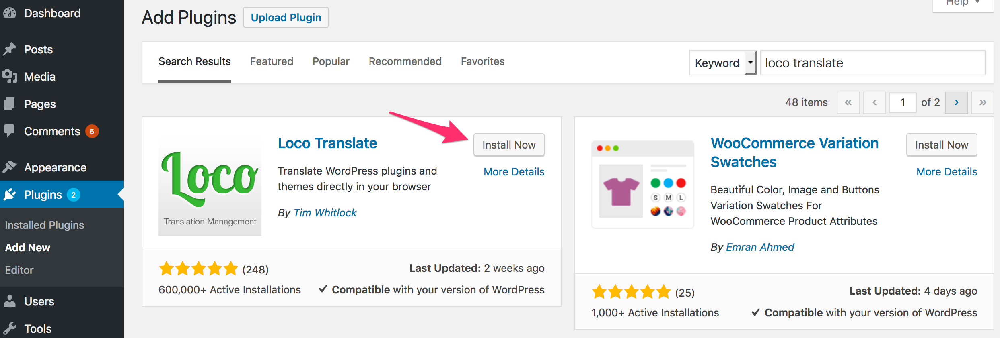
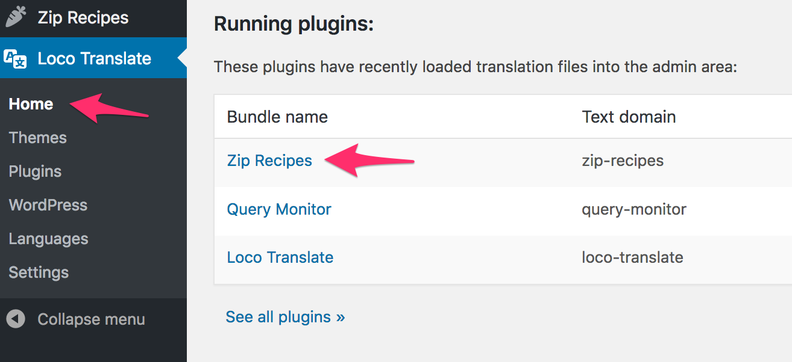
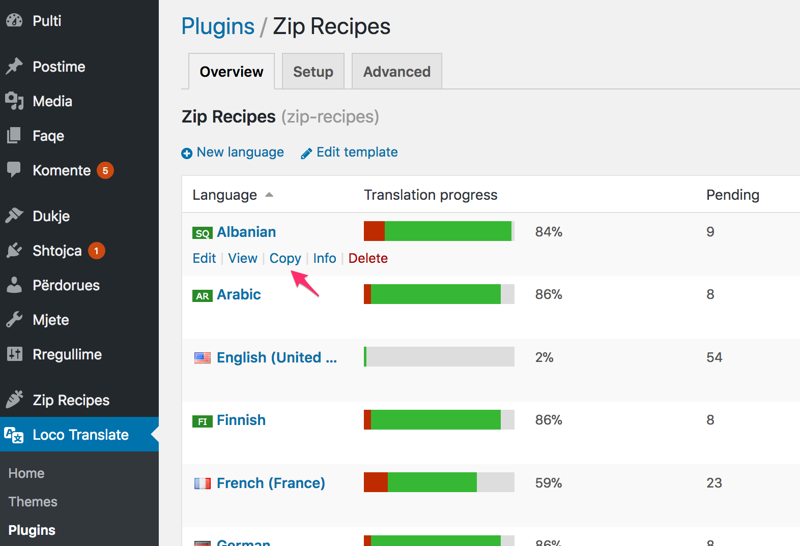
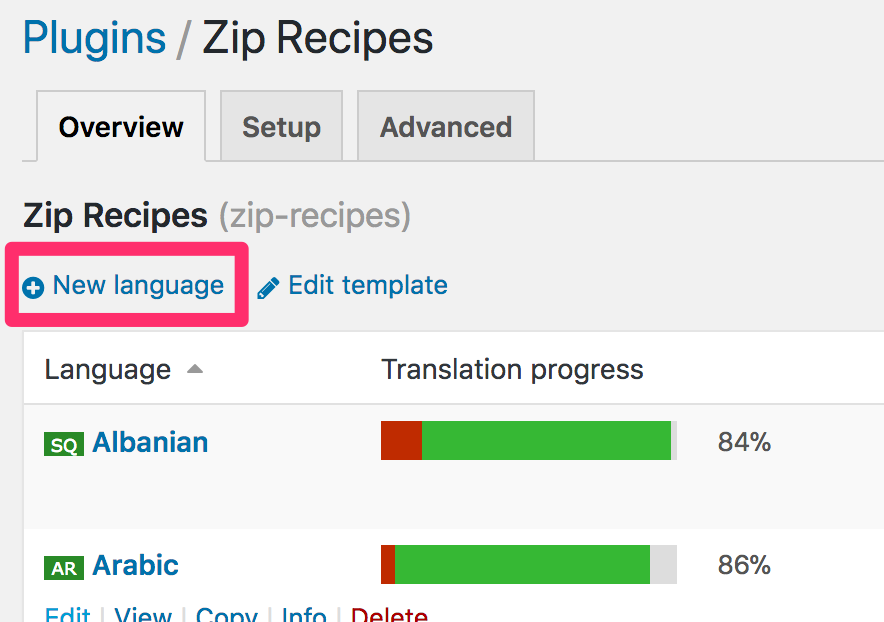
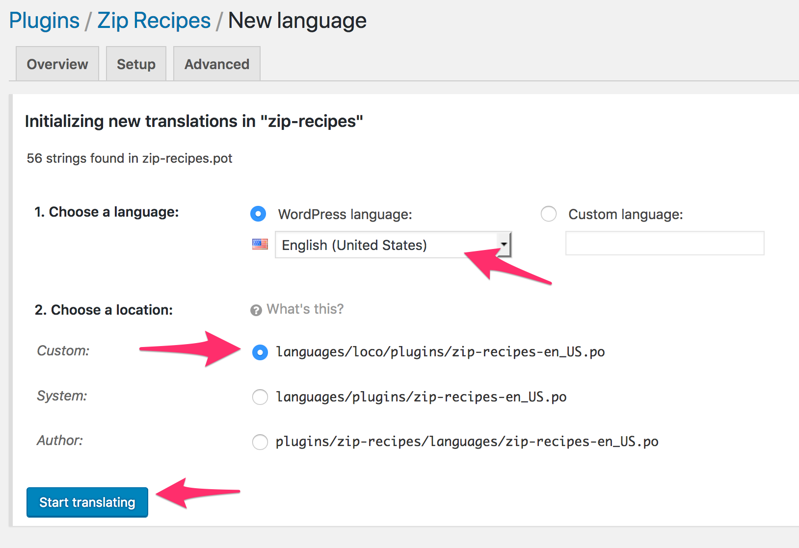
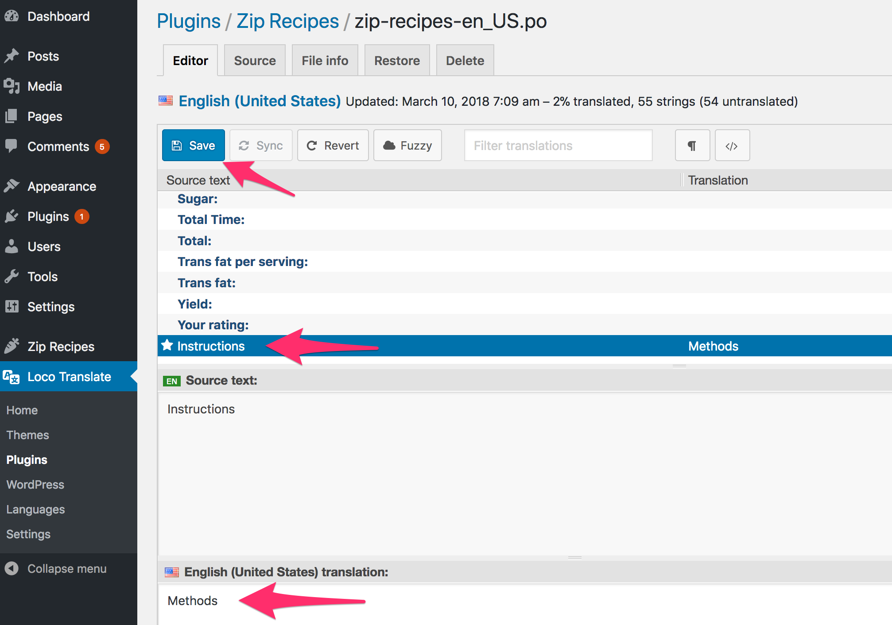

## Background

As plugin authors, sometimes we lack the unique creativity to give *things* creative names 🤪.

For example, on your recipe card, instead of boring `Instructions`, you might want to have `Directions`, or `Path to Deliciousness?`

## Steps

Follow these steps to change recipe card labels (i.e. wording) in Zip Recipes:

1. Install and Activate the [Loco Translate](https://wordpress.org/plugins/loco-translate/) plugin on your website:

2. Click on `Loco Translate` on the left hand menu and then `Zip Recipes` under `Running plugins:` section:

3. Now you'll see a list of languages that Zip Recipes is already translated into.  
**Important:** Do NOT simply edit the language you want to change. This change will be overwritten next time Zip Recipes is updated.
4. If you see your language in the list, click `Copy` to copy it:
  
If your language is not in the list — like `English (United States)` — click `New Language` instead:

5. Now you choose your language and set the location to `Custom`.  
**This is recommended in order to ensure you don't lose your translation when Zip Recipes or WordPress updates.**  
Then you click `Start translating`:

6. Now you'll see the labels used in Zip Recipes under `Source text`. To edit a label, click on it and change the translation at the bottom. Once you do that ensure, you click `Save`:
  
If the source text has a `%d`, ensure you add the `%d` in your translation as well. `%d`s get replaced with numbers. For example `%d minutes` will become `5 minutes`. Same applies for other `%` symbols like `%s`.

Once you click `Save`, you should see the changes in the recipe card right away!

That's all. Happy cooking!