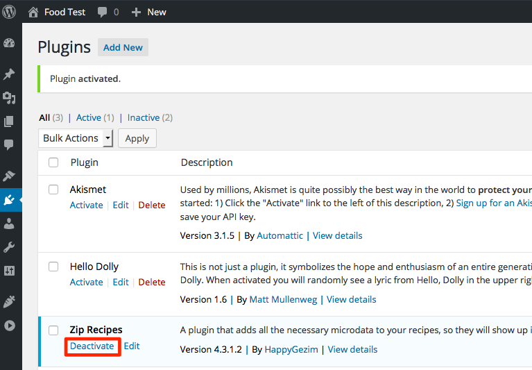
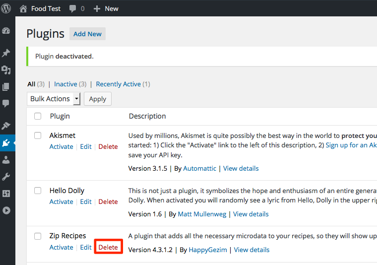
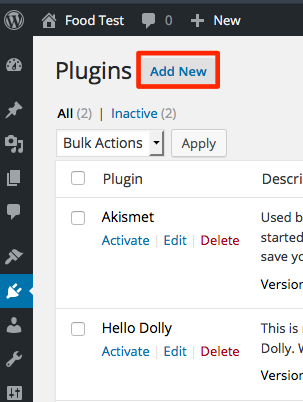
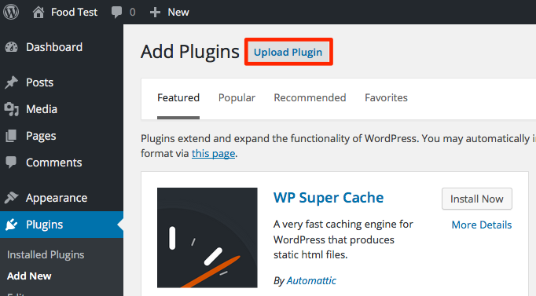
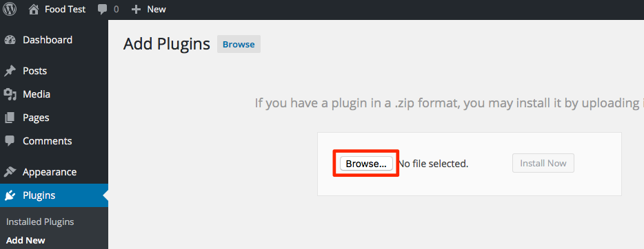
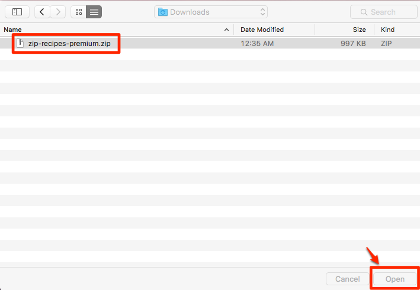
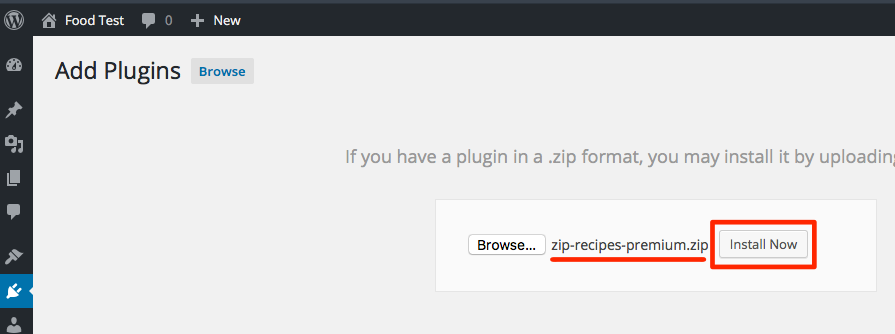
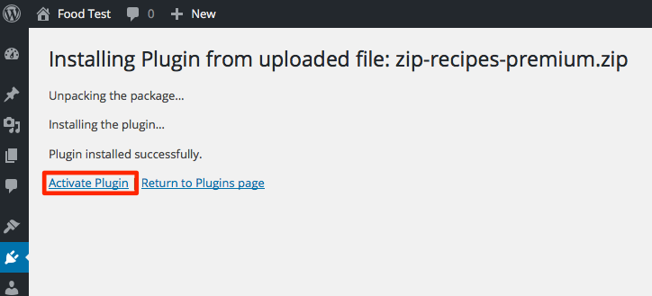

1. [Click here to go to this page](http://forum.ziprecipes.net/search?q=Download%20Zip%20Recipes) then click the top link (titled `Download Zip Recipes ... version`) and download Zip Recipes version you purchased
2. Now, log into your site and go to Admin Dashboard
3. Go to Plugins page
4. Find `Zip Recipes` (or `Zip Recipes Premium`) and `Deactivate` it:

5. Now, delete `Zip Recipes` (or `Zip Recipes Premium`). This will NOT delete your recipes 🙃:

6. Click `Add New` to upload the new plugin:

7. Click `Upload Plugin`:  

8. Click `Browse...` button and find `Zip Recipes Premium.zip` then click `Open` to use it:

9. Then click `Install Now`:

10. Now, click `Activate Plugin` to activate it

11. You've successfully installed Zip Recipes Premium 😁