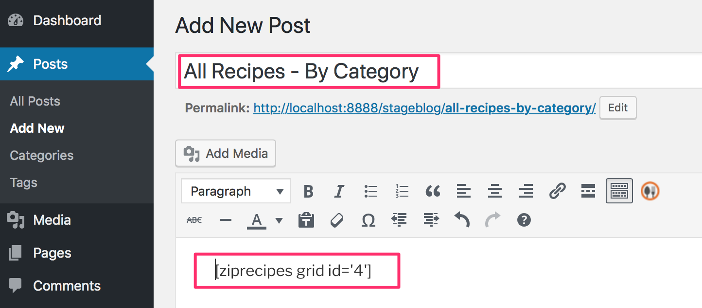

# Creating Your First (Alphabetical) Picture Gallery
1. Under `Zip Recipes` menu click `Recipes Grid`:

2. Click `Create New Recipe Index`:

3. Click `Save`. This will create an `alphabetical` index:

5. Now, let's show the picture gallery in a page. Copy the shortcode by highlighting, right clicking on it and then clicking `Copy`:

5. Create  a new Page by clicking `Pages > Add New` menu:

6. Add a title like `All Recipes - Alphabetically` and then paste the shortcode in the body:

8. Publish it.
9. View the published page.
10. You should see your recipe gallery page. As you can see it's categorized alphabetically:

# Creating Your First Category-based Recipe Gallery

1. Under `Zip Recipes` menu click `Recipes Grid`:

2. Click `Create New Recipe Index`:

3. Select `Recipe category` under `Group recipes using`

3. Click `Save`. This will create a `category` recipe gallery.
4. Copy the shortcode by highlighting, right clicking on it and then clicking `Copy`:

5. Create  a new Page by clicking `Pages > Add New` menu:

6. Add a title like `All Recipes - By Category` and paste the shortcode here:

8. Publish it.
9. View the published page.
10. Now you'll see you recipes grouped by category that they were saved in:
