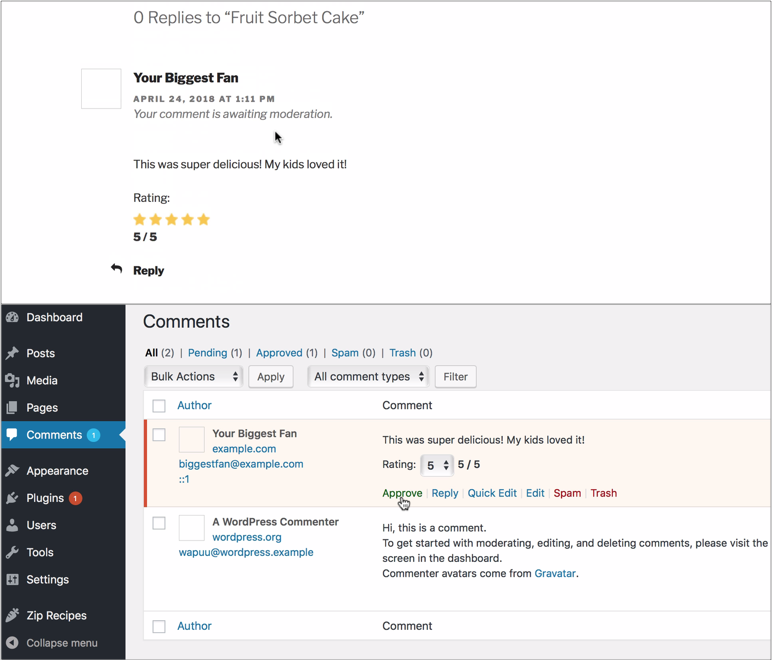
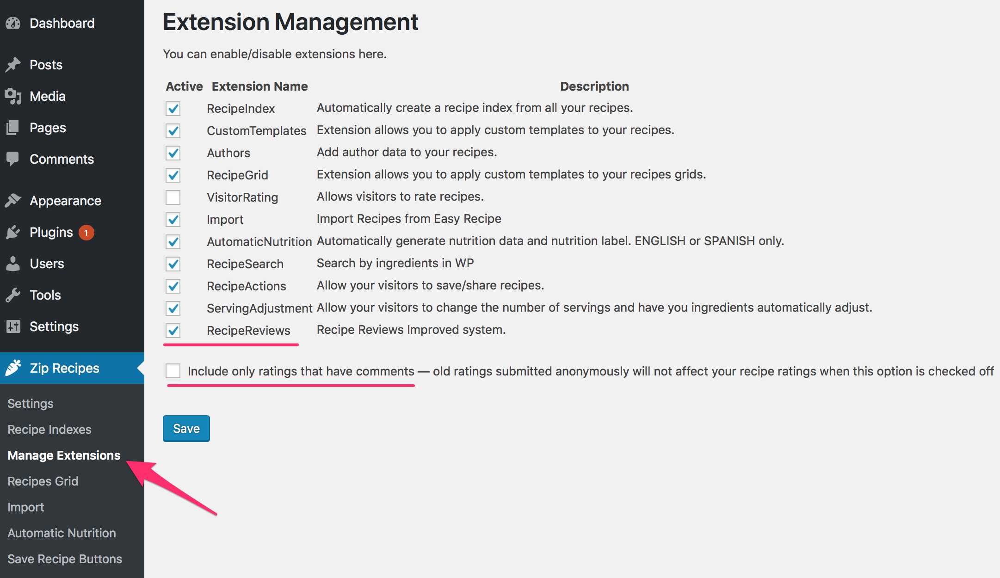

## Overview

It's really encouraging to have people give you feedback on your recipes.

When people can give you feedback, a sense of community is created on your website and it encourages more and more people to join.

`Recipe Reviews` allows your visitors to add a comment with their recipe rating.

You're no longer left wondering what they loved about the recipe — they will give you a 5-star rating with a comment!

## Setup 

1. Go to `Zip Recipes` > `Manage Extensions` from your admin site
2. Check `RecipeReviews`
3. Ensure `VisitorRatings` is unchecked
4. If you already have ratings in your recipes that were done anonymously by visitors (using the `VisitorRatings` feature), you can choose to keep those ratings by checking off `Include only ratings that have comments — old ratings submitted anonymously will not affect your recipe ratings when this option is checked off`
5. Click `Save`

Your visitors will now be able to rate your recipes and leave a comment along side the rating. You can approve these comments or disapproved spam.

`Recipe Reviews` supports [JetPack comments](https://jetpack.com/support/comments/) as well as WordPress comments.