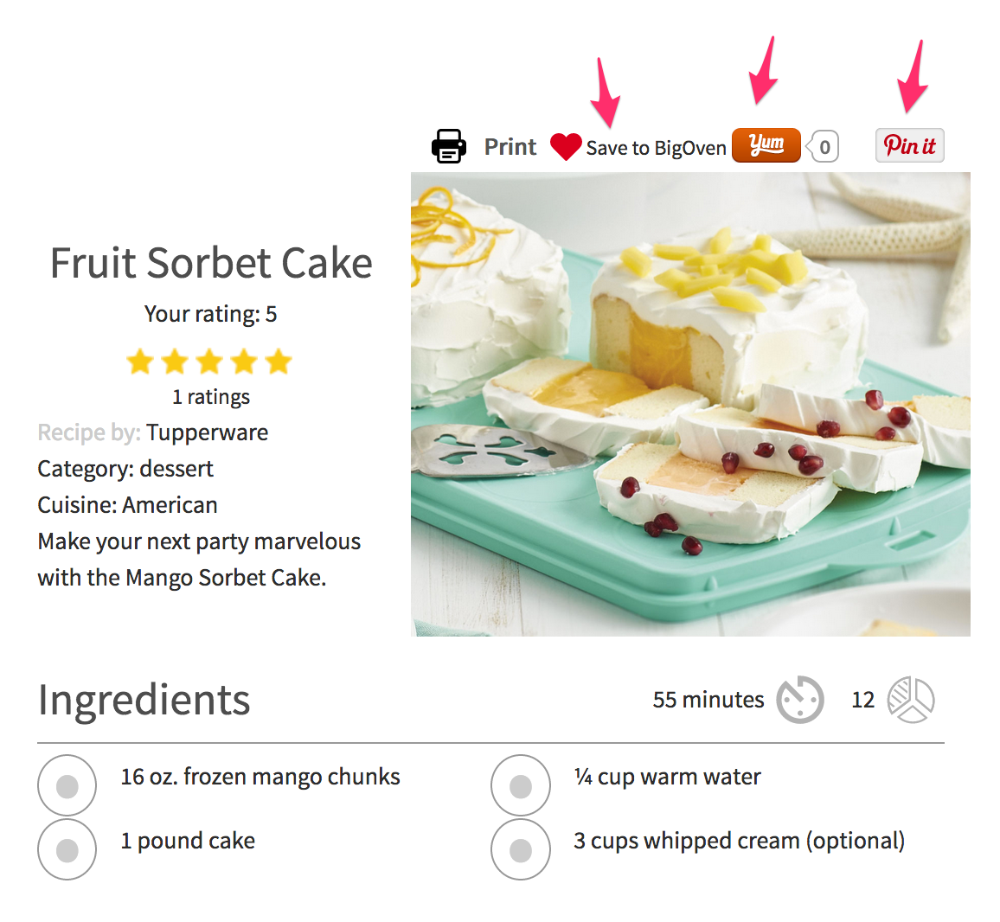
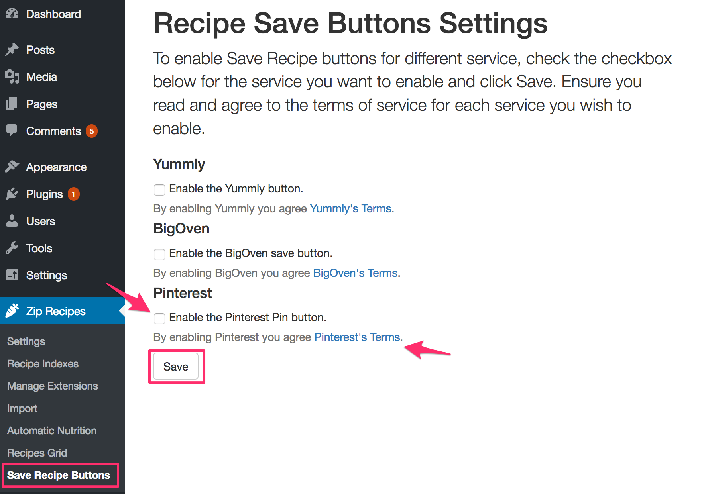

## Background

In order to get the most traffic, you need to spread your recipes far and wide.

Some websites that have garnered a reputation for being recipe hubs are Pinterest, BigOven and Yummly. They each have large communities of people looking for recipes and can be large source of traffic.

In order to appear on these websites, someone has to add your recipes on them. The more people adding your recipes, the more popular your recipes will be and the more visitors they will generate to your website.

## Save Recipe Buttons

Zip Recipes provides `Save Recipe Buttons` for Pinterest, BigOven and Yummly.

This will allow your visitors, with a button click, to add your recipes on these platforms and in turn gain you more visitors.

## Setup 

The setup could not be simpler. 

1. Go to `Zip Recipes > Save Recipe Buttons`
2. Read the terms of the platform you want to enable by clicking on the link. For example Pinterest for Pinterest, click `Pinterest's Terms`.
3. Click `Enable the Pinterest Pin button` for Pinterest or  
`Enable the Yummly button` for Yummly or  
`Enable the BigOven button` for BigOven.
4. Click `Save`

That's all. Now all your recipes will have a button to allow your visitors to save to it.