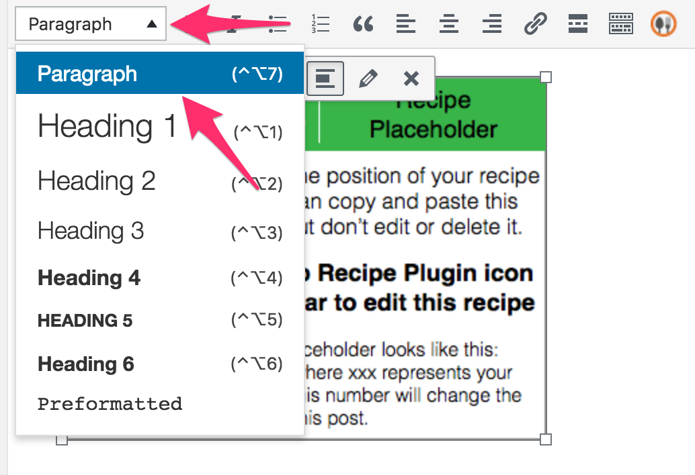

## Issue
You might have been adding recipes and loving it. Then bam, you add a recipe and the text appears huge!

Fret not, my friend. There’s an easy fix. 

The issue was caused because the recipe was inserted while a headline was selected. 

## Solution

### Steps

To fix it:
1. Click the Zip Recipes placeholder:

2. Click the text format dropdown and select `Paragraph`:

3. Update or Publish your recipe post.

### Video
Here’s a video that shows you how to do that as well:
<iframe width="560" height="315" src="https://www.youtube.com/embed/Z9Xc5hFQPJ0" frameborder="0" allow="autoplay; encrypted-media" allowfullscreen></iframe>