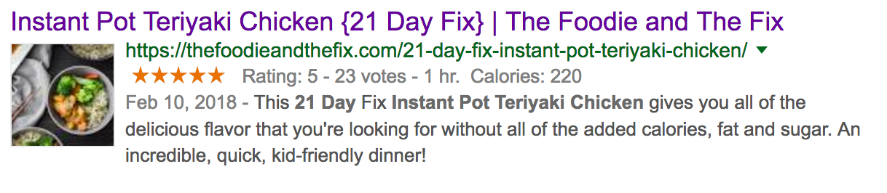

## Usage

Engaging with you readers is very important. The `Visitor Rating` feature allows your website visitors to vote on your recipes without logging in.

When a visitor rates a recipes, they will see that rating in the future and can change it as well. This allows visitors that come back to a recipe frequently to remember how well they liked it:

We have spam protection in place where if we detect that someone's abusing the ratings and clicking too frequently, we start to delay them so your ratings are not affected.

### How it Appears on Search Engines like Google

You recipe ratings will appear on Google's search engine results page and make your recipe pop out!

## Deactivating

If you don't wish to allow your visitors to rate your recipes, you can deactivate this feature from `Zip Recipes > Manage Extensions`.

From the extension list, uncheck `VisitorRating` and then click `Save`:

